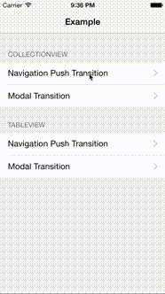
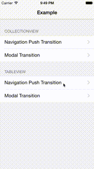

# RMPZoomTransitionAnimator

[](http://cocoapods.org/pods/RMPZoomTransitionAnimator)
[](http://cocoapods.org/pods/RMPZoomTransitionAnimator)
[](http://cocoapods.org/pods/RMPZoomTransitionAnimator)

## Overview

`RMPZoomTransitionAnimator` provide a custom transition zooming animation.

Not only `UICollectionView`, this is possible to use any other `UIViewController` transition.

This transition animation is like the "Pinterest" animation, but this is very simple and small library.




## Installation

RMPZoomTransitionAnimator is available through [CocoaPods](http://cocoapods.org).   
To install
it, simply add the following line to your Podfile:

```ruby
pod "RMPZoomTransitionAnimator"
```

## Usage

To run the example project, clone the repo, and run `pod install` from the Example directory first.

Setup is as below:

### Use for an UINavigationController push transition

Refer to the example project for details.

- Import `RMPZoomTransitionAnimator.h`
- Adopt `RMPZoomTransitionAnimating`
- Implement the `RMPZoomTransitionAnimating` protocol below, both source view controller and destination view controller
  1. `- (UIImageView *)transitionSourceImageView`
  2. `- (UIColor *)transitionSourceBackgroundColor`
  3. `- (CGRect)transitionDestinationImageViewFrame`
- Returns RMPZoomTransitionAnimator instance in the UINavigationController delegate method

```objective-c
- (id <UIViewControllerAnimatedTransitioning>)navigationController:(UINavigationController *)navigationController
                                   animationControllerForOperation:(UINavigationControllerOperation)operation
                                                fromViewController:(UIViewController *)fromVC
                                                  toViewController:(UIViewController *)toVC
{
    // minimum implementation for example
    RMPZoomTransitionAnimator *animator = [[RMPZoomTransitionAnimator alloc] init];
    animator.goingForward = (operation == UINavigationControllerOperationPush);
    animator.sourceTransition = (id<RMPZoomTransitionAnimating>)fromVC;
    animator.destinationTransition = (id<RMPZoomTransitionAnimating>)toVC;
    return animator;
}
```

### Use for a modal transition

Refer to the example project for details.

- Import `RMPZoomTransitionAnimator.h`
- Adopt `RMPZoomTransitionAnimating`
- Implement `RMPZoomTransitionAnimating` protocol below, both source view controller and destination view controller
  1. `- (UIImageView *)transitionSourceImageView`
  2. `- (UIColor *)transitionSourceBackgroundColor`
  3. `- (CGRect)transitionDestinationImageViewFrame`
- Set the transitioningDelegate in `prepareForSegue:sender:`
- Returns RMPZoomTransitionAnimator instance in the UIViewControllerTransitioningDelegate method

```objective-c
- (id<UIViewControllerAnimatedTransitioning>)animationControllerForPresentedController:(UIViewController *)presented
                                                                  presentingController:(UIViewController *)presenting
                                                                      sourceController:(UIViewController *)source
{
    // minimum implementation for example
    RMPZoomTransitionAnimator *animator = [[RMPZoomTransitionAnimator alloc] init];
    animator.goingForward = YES;
    animator.sourceTransition = (id<RMPZoomTransitionAnimating>)source;
    animator.destinationTransition = (id<RMPZoomTransitionAnimating>)presented;
    return animator;
}

- (id<UIViewControllerAnimatedTransitioning>)animationControllerForDismissedController:(UIViewController *)dismissed
{
    // minimum implementation for example
    RMPZoomTransitionAnimator *animator = [[RMPZoomTransitionAnimator alloc] init];
    animator.goingForward = NO;
    animator.sourceTransition = (id<RMPZoomTransitionAnimating>)dismissed;
    animator.destinationTransition = (id<RMPZoomTransitionAnimating>)self;
    return animator;
}
```

## Requirements

- iOS 7.0 or higher 

## Contribution

If you have feature requests or bug reports, feel free to help out by sending pull requests or by creating new issues.

## Author

Recruit Marketing Partners Co.,Ltd. recruit_mp_oss@ml.cocorou.jp

## License

RMPZoomTransitionAnimator is available under the MIT license.
